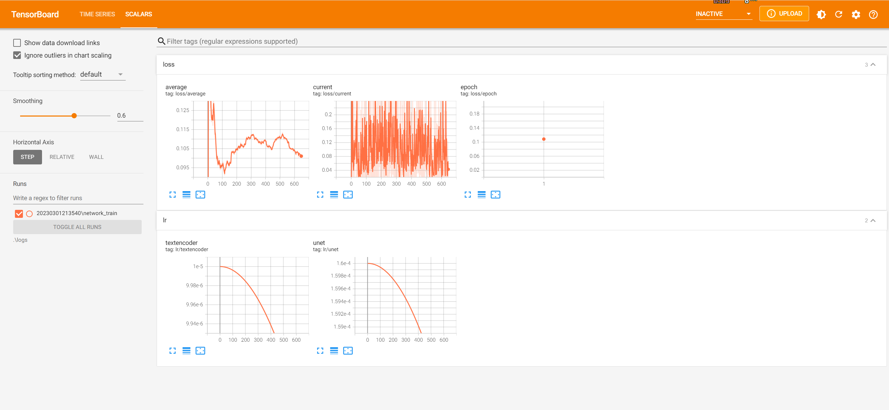

此部分用于训练Lora模型
项目来源于
https://github.com/Akegarasu/lora-scripts.git


# LoRA-scripts

LoRA training scripts for [kohya-ss/sd-scripts](https://github.com/kohya-ss/sd-scripts.git)

## Usage

### Clone repo with submodules

```sh
git clone --recurse-submodules https://github.com/Akegarasu/lora-scripts
```

### Required Dependencies

Python 3.10.8 and Git

### Windows

#### Installation

Run `install.ps1` will automaticilly create a venv for you and install necessary deps.

#### Train

Edit `train.ps1`, and run it.

### Linux

#### Installation

Run `install.bash` will create a venv and install necessary deps.

#### Train

Training script `train.sh` **will not** activate venv for you. You should activate venv first.

```sh
source venv/bin/activate
```

Edit `train.sh`, and run it.

#### TensorBoard

Run `tensorboard.ps1` will start TensorBoard at http://localhost:6006/




情况记录：

1.Linux环境直接使用install.sh 脚本容易出现包括git子目录无法克隆等问题，建议手动执行并排除

2.环境配置建议使用豆瓣源 -i http://pypi.douban.com/simple/ --trusted-host=pypi.douban.com/simple ipython 对此项目配置基本有效

3.直接运行train.sh会出现NameError: name 'BinaryIO' is not defined的报错，无法解决。但是直接在文件/lora_train/1/lora-scripts/sd-scripts/library/huggingface_util.py", line 25中注释掉可以运行